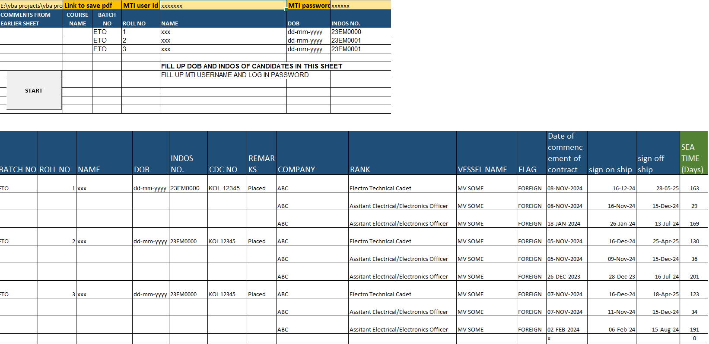

# Maritime-Seatime-Analyzer
This project is an Excel VBA-based tool developed to automate the tracking and analysis of onboard training (sea-time) for maritime students, using data sourced from the DG Shipping portal. It is designed specifically for Maritime Training Institutes (MTIs) and companies to improve efficiency and compliance in monitoring cadet progress. 

## Overview
This tool tracks and analyzes onboard training progress of maritime students using DG Shipping data.

It helps Maritime Training Institutes monitor cadet development and identify delays in required sea-time completion.

## Problem Statement
Tracking sea-time manually for multiple students is inefficient and lacks real-time visibility.

Institutes often struggle to identify:
- Students falling behind schedule
- Gaps in onboard training
- Overall batch performance

## Solution
Developed a system that:

- Extracts student ship data from DG Shipping sources
- Tracks sea-time progression
- Provides insights into training status
- Highlights delays and potential risks

## Key Features
- Automated data extraction
- Sea-time progress tracking
- Individual and batch-level monitoring
- Early warning indicators for delays

## Technology Used
- Excel VBA
- Web data extraction

## Future Enhancements
- Power BI dashboard integration
- Predictive alerts for training delays
- Cloud-based deployment

## Sample Interface

